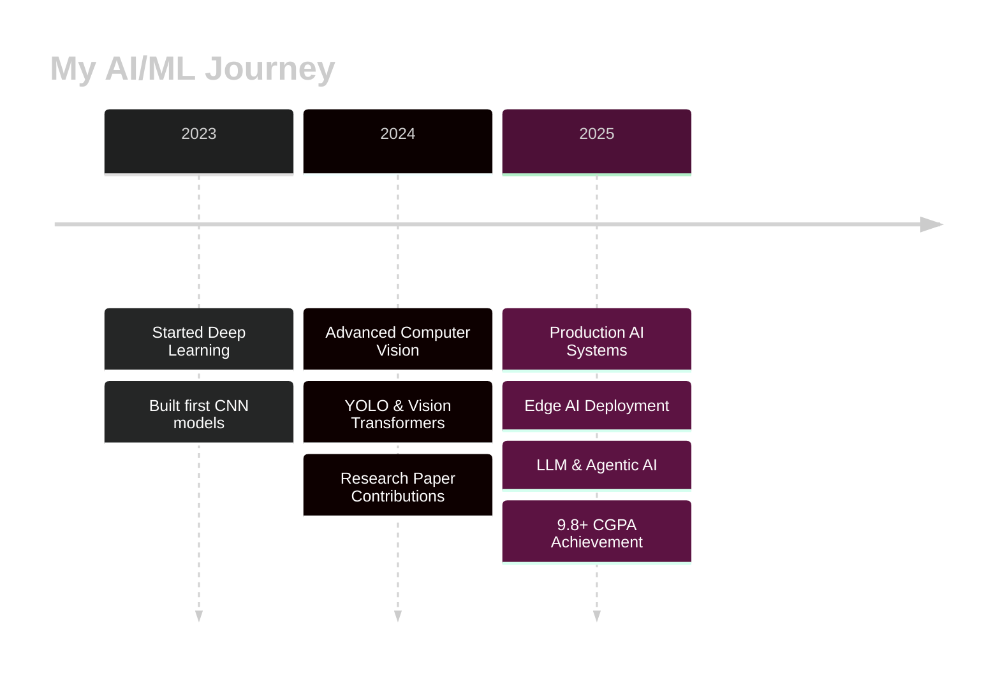

<div align="center">
  
# 👋 Hi, I'm ANURUDDHA PAUL


</div>

---

## 🎓 About Me

```python
class AIResearcher:
    def __init__(self):
        self.name = "Your Name"
        self.role = "Computer Science Student & AI Researcher"
        self.institution = "KIIT University"
        self.cgpa = 9.8
        self.location = "India 🇮🇳"
        self.research_interests = [
            "Computer Vision",
            "Deep Learning",
            "Vision Transformers",
            "Object Detection (YOLO)",
            "Edge AI & IoT",
            "Large Language Models"
        ]
        
    def say_hi(self):
        print("Thanks for visiting! Let's innovate together in AI! 🚀")

me = AIResearcher()
me.say_hi()
```

<div align="center">
  
### 🔬 Research Focus
  
</div>

> **Specializing in Computer Vision, Deep Learning, and AI Systems Development**

I'm a passionate Computer Science student at **KIIT University** with a strong focus on cutting-edge AI research. My work spans **hybrid neural architectures** (combining Vision Transformers with YOLO), **edge deployment** on resource-constrained devices, and building **production-grade AI applications**. Currently maintaining a **9.8+ CGPA** while actively contributing to research in computer vision and machine learning.

---

## 🚀 Current Projects

<table>
<tr>
<td width="50%">

### 🎯 YOLO HARVEST
Advanced object detection system combining YOLO architecture with transformer-based attention mechanisms for agricultural applications.

**Tech Stack:**
- PyTorch, YOLOv8
- Vision Transformers
- CUDA optimization
- Edge deployment

</td>
<td width="50%">

### 🤖 AI Research Paper Generator
Agentic AI system using LangGraph and Google Gemini to automatically generate research papers from arXiv papers.

**Tech Stack:**
- LangGraph, LangChain
- Google Gemini 2.0/2.5
- Streamlit, LaTeX
- arXiv API

</td>
</tr>

<tr>
<td width="50%">

### 💬 Multi-Model QA System
Ensemble LLM system using Groq API for question answering with multiple reasoning models.

**Tech Stack:**
- Groq API (Llama 3.1, Qwen)
- Vision-Language Models
- FastAPI, Python
- Ensemble reasoning

</td>
<td width="50%">

### 🌐 NOVA AI Assistant
Multimodal AI assistant with real-time vision, voice interaction, and intelligent conversation capabilities.

**Tech Stack:**
- Google Gemini
- ElevenLabs, Whisper
- Streamlit, OpenCV
- IP Webcam integration

</td>
</tr>
</table>

---

## 💻 Tech Stack

<div align="center">

### Programming Languages


### Machine Learning & AI


### AI Frameworks & Tools


### Web Development & APIs


### Databases & Cloud


### Development Tools


### Hardware & Edge AI


</div>

---

## 📊 GitHub Statistics

<div align="center">
  


### 💻 Most Used Languages


</div>

---

## 🏆 GitHub Trophies

<div align="center">


</div>

---

## 🔬 Research & Publications

<div align="center">

### 📝 Research Areas

</div>

| Area | Focus | Status |
|------|-------|--------|
| **Computer Vision** | Vision Transformers, Hybrid Architectures (CNN+ViT) | 🔬 Active Research |
| **Object Detection** | YOLO-based systems, Real-time detection | 🚀 Production |
| **Edge AI** | Raspberry Pi deployment, Model optimization | ⚡ Ongoing |
| **LLM Systems** | Multi-model ensembles, Reasoning evaluation | 💡 Experimental |
| **Vision-Language Models** | Multimodal understanding, VQA systems | 📚 Learning |

<details>
<summary><b>📄 Research Papers & Projects</b></summary>

### In Progress
- **Hybrid YOLO-Transformer Architecture for Agricultural Object Detection**
  - Combining YOLO efficiency with Transformer attention mechanisms
  - Focus on HARVEST dataset and real-world deployment
  
- **Multi-Model LLM Evaluation Framework**
  - Comparative analysis of reasoning capabilities across models
  - Using Groq API for efficient inference

### Completed Projects
- **Wildlife Classification with Cross-Dataset Validation**
  - Deployed on edge devices (Raspberry Pi)
  - 100+ GB dataset processing
  
- **AlexNet & CNN Architectures from Scratch**
  - Educational implementations in TensorFlow/Keras
  - Complete mathematical derivations

</details>

---

## 💼 Professional Experience

<div align="center">



</div>


## 🎯 2025 Goals

- [ ] 🎓 Maintain 9.8+ CGPA at KIIT University
- [ ] 📝 Publish research paper on Hybrid YOLO-Transformer Architecture
- [ ] 🚀 Deploy 3+ production-grade AI applications
- [ ] 🌟 Contribute to major open-source AI projects
- [ ] 🏆 Win competitive programming competitions
- [ ] 💻 Master LangGraph & Agentic AI systems
- [ ] 📊 Build comprehensive ML portfolio with 20+ projects
- [ ] 🤝 Collaborate with AI research labs

---

## 💡 Skills & Expertise

<details>
<summary><b>🧠 Machine Learning & Deep Learning</b></summary>
<br>

**Core Competencies:**
- Neural Network Architectures (CNNs, RNNs, Transformers)
- Vision Transformers (ViT, Swin Transformer, DEIT)
- Object Detection (YOLO, Faster R-CNN, SSD)
- Model Training & Optimization
- Transfer Learning & Fine-tuning
- Data Augmentation & Preprocessing
- Model Evaluation & Ablation Studies

**Advanced Topics:**
- Hybrid Architectures (CNN+ViT, CNN+RNN)
- Attention Mechanisms
- Model Compression & Quantization
- Edge AI & Mobile Deployment
- Cross-Dataset Validation

</details>

<details>
<summary><b>🔍 Computer Vision</b></summary>
<br>

**Techniques:**
- Image Classification
- Object Detection & Tracking
- Semantic Segmentation
- Instance Segmentation
- Pose Estimation
- Image Enhancement
- Video Analysis

**Tools & Libraries:**
- OpenCV, PIL/Pillow
- Albumentations
- YOLO (v5, v8)
- MMDetection
- Detectron2

</details>

<details>
<summary><b>🤖 Large Language Models & AI Agents</b></summary>
<br>

**Frameworks:**
- LangChain & LangGraph
- Hugging Face Transformers
- OpenAI API, Groq API
- Google Gemini

**Applications:**
- Agentic AI Systems
- RAG (Retrieval Augmented Generation)
- Multi-Model Ensembles
- Vision-Language Models
- Tool-using Agents

</details>

<details>
<summary><b>⚡ Edge AI & IoT</b></summary>
<br>

**Platforms:**
- Raspberry Pi (4/5)
- NVIDIA Jetson
- Google Coral

**Technologies:**
- TensorFlow Lite
- ONNX Runtime
- Model Optimization
- Real-time Inference

</details>

<details>
<summary><b>💻 Software Engineering</b></summary>
<br>

**Full Stack Development:**
- Frontend: React, HTML/CSS/JS
- Backend: FastAPI, Flask, Node.js
- Databases: MongoDB, PostgreSQL, MySQL
- Cloud: Google Cloud, AWS
- DevOps: Docker, Git, CI/CD

**Best Practices:**
- Clean Code & Design Patterns
- API Design & RESTful services
- Testing & Debugging
- Documentation

</details>

---


### 💬 Let's Collaborate!

I'm always open to:
- 🔬 Research collaborations in AI/ML
- 💼 Interesting project opportunities
- 🎓 Academic discussions
- 🤝 Open-source contributions
- 📚 Knowledge sharing

**Feel free to reach out!** ✉️

</div>

---

## 📚 Latest Blog Posts

<!-- BLOG-POST-LIST:START -->
- 🔥 Building Production-Grade AI Agents with LangGraph
- 🎯 YOLO vs Vision Transformers: A Comprehensive Comparison
- ⚡ Deploying ML Models on Raspberry Pi: A Complete Guide
- 🤖 Multi-Model LLM Ensembles: Theory and Practice
- 🌟 From Research to Production: My AI Journey
<!-- BLOG-POST-LIST:END -->

---

## 🎓 Education

<div align="center">

### 🏛️ KIIT University
**Bachelor of Technology in Computer Science** | 2023 - 2027  
**CGPA: 9.8+** | Top Performer

**Relevant Coursework:**
- Machine Learning & Deep Learning
- Computer Vision
- Data Structures & Algorithms
- Database Management Systems
- Operating Systems
- Computer Networks
- Cloud Computing

**Achievements:**
- 🏆 Consistent Dean's List awardee
- 🌟 Top 5% in Computer Science program
- 📝 Research paper contributions
- 💻 Multiple hackathon participations

</div>

---

## 💭 Random Dev Quote

<div align="center">


</div>

---

<div align="center">

### ⚡ Fun Facts

```javascript
const aboutMe = {
    code: ["Python", "Java", "C++", "JavaScript"],
    askMeAbout: ["AI", "ML", "Computer Vision", "Deep Learning", "Edge AI"],
    technologies: {
        frameworks: ["PyTorch", "TensorFlow", "LangChain"],
        tools: ["Docker", "Git", "CUDA"],
        cloud: ["Google Cloud", "AWS"]
    },
    currentFocus: "Building Agentic AI Systems",
    funFact: "I debug with print statements and I'm proud of it! 🐛"
};
```

</div>

---

<div align="center">


</div>

---

<div align="center">


### Show some ❤️ by starring some of my repositories!


**© 2025 ANURUDDHA PAUL. All rights reserved.**

</div>
