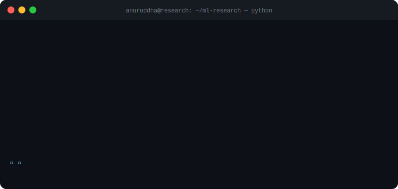

<div align="center">


</div>

---

<div align="center">

[](mailto:anuruddhapaul4@gmail.com)&nbsp;
[](https://linkedin.com/in/anuruddha-paul)&nbsp;
[](YOUR_GOOGLE_SCHOLAR_LINK)&nbsp;
[](https://github.com/ANURUDDHAPAUL)

</div>

---

<div align="center">



</div>

---

## 🏆 Achievements at a Glance

<div align="center">

<table>
<tr>
<td align="center" width="25%">
<br/>
<sub><b>Perfect semester SGPA 10.00</b></sub>
</td>
<td align="center" width="25%">
<br/>
<sub><b>All 5 semesters consistently</b></sub>
</td>
<td align="center" width="25%">
<br/>
<sub><b>Elsevier · Wiley · IEEE · Springer</b></sub>
</td>
<td align="center" width="25%">
<br/>
<sub><b>Awarded for exceptional performance</b></sub>
</td>
</tr>
</table>

</div>

---

## 🎓 About Me

```python
class AIResearcher:
    def __init__(self):
        self.name            = "Anuruddha Paul"
        self.role            = "AI / ML Researcher & Engineer"
        self.institution     = "KIIT University, Bhubaneswar"
        self.cgpa            = 9.81
        self.branch_rank     = "#1 of ~300 students (all 5 semesters)"
        self.publications    = 7   # Elsevier, Wiley, IEEE, Springer
        self.location        = "Bhubaneswar, India 🇮🇳"
        self.research        = [
            "Computer Vision & Vision Transformers",
            "Hybrid Architectures (YOLOv8 + ViT)",
            "Vision-Language Models (CLIP, BioCLIP)",
            "Edge AI & Model Deployment",
            "Large Language Models & Agentic AI",
        ]

    def say_hi(self):
        print("Thanks for visiting! Let's push the boundaries of AI together 🚀")

me = AIResearcher()
me.say_hi()
```

> **Specializing in Computer Vision, Deep Learning, and Multimodal AI Systems**

Third-year B.Tech. student at **KIIT University** with a **9.81 CGPA** and **Branch Rank #1** (∼300 students). Published author with **7 research outputs** across *Ecological Informatics* (Elsevier), *Engineering Reports* (Wiley), IEEE, and Springer — all conducted independently as an undergraduate. Expert in designing novel hybrid architectures, building VLM evaluation frameworks, fine-tuning large multimodal models, and deploying deep learning systems from first principles.

---

## 📝 Publications &nbsp;<sub>7 total · 3 Journals · 2 Conferences · 2 Under Review</sub>

### Journals

| # | Title | Venue | Date |
|---|-------|-------|------|
| **J1** | YOLO-HARVEST: A Hybrid ViT Architecture with Locality-Enhanced Attention for Automated Wildlife Species Classification | *Ecological Informatics*, **Elsevier** | ✅ Jan 2026 |
| **J2** | HARVEST: A Locality-Enhanced Vision Transformer for Efficient Multi-Level Grocery Classification | *Engineering Reports*, **Wiley** | ✅ Jan 2026 |
| **J3** | Hybrid Binary SGO-GA for Solving the Max-SAT Problem | *Procedia Computer Science*, **Elsevier** | ✅ Jan 2025 |

### Conferences

| # | Title | Venue | Date |
|---|-------|-------|------|
| **C1** | An Empirical Analysis for Predicting Obesity Levels Using Machine Learning Models | **IEEE** ICIICS 2024 | ✅ Nov 2024 |
| **C2** | Machine Learning Methodologies in Social Platforms: An Analytical Survey | **Springer** ICSCSP | ✅ Jun 2024 |

### Under Review / Submitted

| # | Title | Target | Status |
|---|-------|--------|--------|
| **S1** | Visual Context Dependency in Wildlife Classification: A Systematic Study of Vision-Language Models | Vision Conference | 🔄 Under Review |
| **S2** | Beyond Images: Metadata-Augmented Multimodal Fusion for Wildlife Classification | **ECAI** Conference | 🔄 Submitted |

---

## 🔬 Research Experience

<table>
<tr>
<td width="50%">

### 🌿 HARVEST Framework
*Published — Elsevier & Wiley (Jan 2026)*

Built a hybrid **YOLOv8 + Vision Transformer** architecture integrating **Shifted Patch Tokenization (SPT)**, **Local Information Enhancer (LIFE)**, and **Locality-Enhanced Attention (LEA)**. Addressed severe class imbalance in wildlife camera trap datasets. Extended to hierarchical grocery classification with reduced parameter overhead.

</td>
<td width="50%">

### 🦁 Wildlife VLM Evaluation
*KIIT University — 2024 → Present*

Designed controlled background-ablation experiments on **CLIP, BioCLIP, OpenCLIP** across OSU Small Animals & Caltech datasets. Introduced **3 novel evaluation metrics**: Context Dependency Score (CDS), Context Robustness (CR), Prompt Sensitivity (PS). Revealed 40%+ background-driven classification decisions.

</td>
</tr>
<tr>
<td width="50%">

### 🔀 Multimodal Fusion
*Submitted — ECAI Conference*

Proposed additive fusion architecture combining **frozen YOLOv8 embeddings** with temporal-spatial metadata via **cyclic temporal encoding** and spatial clustering. Conducted ablation studies characterizing catastrophic forgetting in frozen backbone fine-tuning.

</td>
<td width="50%">

### 🤖 LLM & Agentic AI Systems
*Open Source — GitHub*

Fine-tuned **Qwen2.5-VL 7B** multimodal model using supervised fine-tuning with LoRA. Built autonomous multi-agent research system using LangChain, CrewAI, and RAG pipelines. Implemented MCP server for AI model orchestration.

</td>
</tr>
</table>

---

## 🚀 Key Projects

<table>
<tr>
<td width="50%">

### 📚 From-Scratch CNN Architecture Library
Complete ground-up **PyTorch** implementations of: AlexNet, VGGNet, ResNet, InceptionNet, DenseNet, MobileNet, SqueezeNet + full **VLM from scratch**. Each repo includes mathematical forward/backprop documentation.

</td>
<td width="50%">

### 🤖 AI Research Agent
Autonomous research agent (`ai-researcher-main`) for multi-source search, summarization, and synthesis using **LangChain + CrewAI + RAG**. Powered by multi-agent orchestration with vector databases.

</td>
</tr>
<tr>
<td width="50%">

### 🌐 NOVA AI Assistant
Multimodal AI assistant with real-time vision, voice interaction, and intelligent conversation using **Google Gemini**, ElevenLabs TTS, Whisper STT, and IP webcam integration.

</td>
<td width="50%">

### 🧠 SFT Qwen2.5-VL 7B
Domain-adapted a **7B multimodal LLM** using supervised fine-tuning with LoRA via Hugging Face Transformers for specialized vision-language tasks.

</td>
</tr>
</table>

---

## 💻 Tech Stack

<div align="center">

### Programming Languages


### Deep Learning & Computer Vision


### Vision-Language & LLM Stack


### Web & APIs


### Databases, Cloud & Tools


### Hardware & Edge AI


</div>

---

## 📊 GitHub Statistics

<div align="center">


### 💻 Most Used Languages


</div>

---

## 🏆 GitHub Trophies

<div align="center">


</div>

---

## 🎓 Education

### 🏛️ KIIT University — Bhubaneswar, Odisha
**B.Tech. in Computer Science & Systems Engineering** &nbsp;|&nbsp; Aug 2023 – May 2027

| Metric | Value |
|--------|-------|
| **CGPA** | 9.81 / 10.00 |
| **Branch Rank** | #1 of ~300 students (Semesters 1–5) |
| **Semester SGPAs** | 10.00 · 9.85 · 9.74 · 9.86 · 9.64 |
| **Scholarship** | KIIT Merit Scholarship |

**Relevant Coursework:** Machine Learning · Artificial Intelligence · Design & Analysis of Algorithms · Computer Organization & Architecture · Operating Systems · DBMS · Signals & Systems · Probability & Statistics · Agentic AI · Compilers · ARM & Advanced Processors

---

## 📜 Certifications

<details>
<summary><b>View all certifications (11 courses)</b></summary>
<br>

- **Machine Learning Specialization** — DeepLearning.AI (Coursera)
- **Deep Learning Specialization** — DeepLearning.AI (Coursera)
- **LangChain for LLM Application Development** — DeepLearning.AI
- **Multi AI Agent Systems with CrewAI** — DeepLearning.AI
- **Preprocessing Unstructured Data for LLM Applications** — Coursera
- **Google AI Essentials** — Google
- **System Design Fundamentals** — Coursera
- **Learn MLOps for Machine Learning** — Coursera
- **Build a Modern Computer from First Principles (Nand2Tetris)** — Coursera
- **Mathematics for Computer Science** — Coursera
- **Introduction to Computer Science and Programming** — Coursera

</details>

---

## 💡 Skills & Expertise

<details>
<summary><b>🧠 Machine Learning & Deep Learning</b></summary>
<br>

- CNNs, Vision Transformers (ViT, Swin, DeiT), Hybrid Architectures (CNN+ViT)
- Object Detection: YOLOv8, Faster R-CNN, SSD
- Model Compression, Quantization & Edge Deployment
- Transfer Learning, Fine-tuning (LoRA, SFT)
- Contrastive Learning, Zero-shot Classification

</details>

<details>
<summary><b>🔍 Computer Vision & VLMs</b></summary>
<br>

- Image Classification, Object Detection, Semantic Segmentation
- Vision-Language Models: CLIP, BioCLIP, OpenCLIP, Qwen2.5-VL
- Novel metric design: CDS, CR, PS evaluation frameworks
- Camera trap analysis, wildlife classification
- OpenCV, Albumentations, MMDetection, Detectron2

</details>

<details>
<summary><b>🤖 LLM & Agentic AI</b></summary>
<br>

- LangChain, LangGraph, CrewAI
- RAG pipelines, vector databases, multi-agent orchestration
- Supervised fine-tuning (SFT) with LoRA on 7B+ models
- Tool-using agents, MCP servers

</details>

<details>
<summary><b>⚡ Edge AI & Embedded Systems</b></summary>
<br>

- Raspberry Pi 4/5, NVIDIA Jetson, Google Coral
- ARM Cortex-M (LPC2148), digital combinational logic
- TensorFlow Lite, ONNX Runtime, real-time inference

</details>

---

## 🎯 2025–2026 Goals

- [x] 🎓 Maintain Branch Rank #1 at KIIT University
- [x] 📝 Publish in top journals (Elsevier, Wiley) as sole first-author
- [x] 🚀 Deploy production-grade AI applications
- [x] 📊 Build comprehensive ML portfolio with 20+ projects
- [ ] 🌟 Contribute to major open-source AI projects
- [ ] 🏆 Win competitive AI/ML competitions
- [ ] 💻 Acceptance at a research internship in AI/ML

---

<div align="center">

### 💬 Let's Collaborate

I'm open to **research collaborations**, **internships**, **open-source contributions**, and **academic discussions** in AI/ML.

[](mailto:anuruddhapaul4@gmail.com)
[](https://linkedin.com/in/anuruddha-paul)
[](YOUR_GOOGLE_SCHOLAR_LINK)

</div>

---

<div align="center">


</div>

---

<div align="center">

```javascript
const anuruddha = {
    currently:   "3rd Year B.Tech @ KIIT  |  Branch Rank #1",
    research:    ["Computer Vision", "VLMs", "Hybrid Architectures", "Edge AI"],
    published:   "7 papers → Elsevier · Wiley · IEEE · Springer",
    building:    "Agentic AI Systems & Multimodal Models",
    gpu:         "RTX 5070 Ti",
    funFact:     "I debug with print statements and I'm proud of it 🐛"
};
```

</div>

---


<div align="center">

### Show some ❤️ by starring some of my repositories!

**© 2026 ANURUDDHA PAUL · All rights reserved.**

</div>
